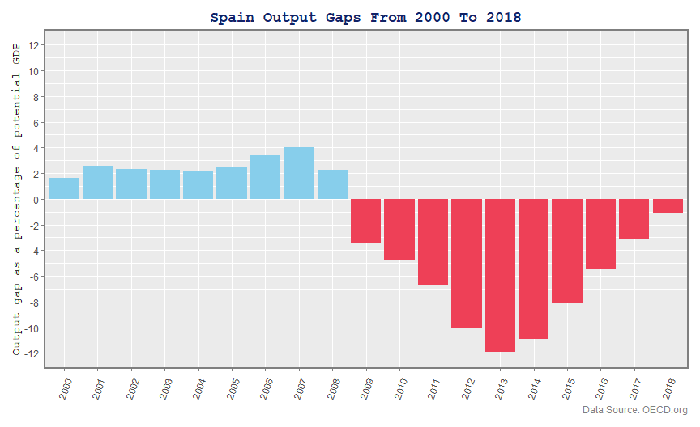
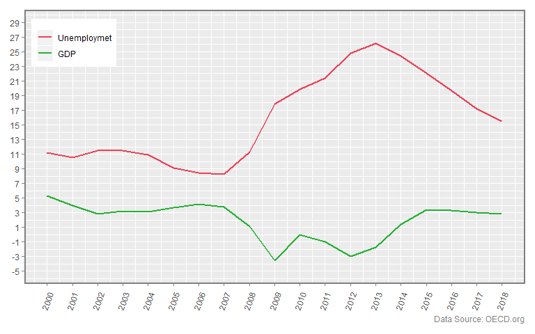
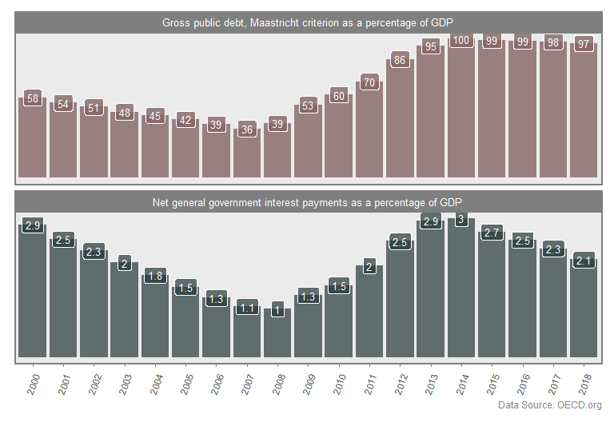
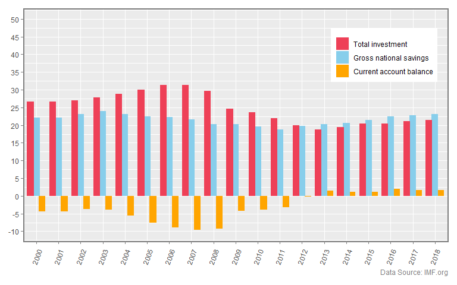
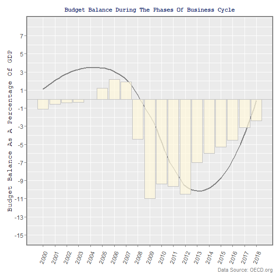
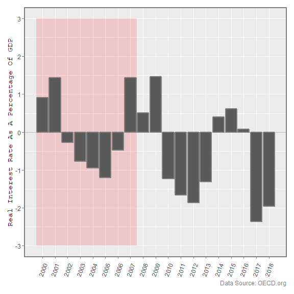

# The Spanish Financial Crisis

The Spanish economic crisis, which began at 2006 and extended after the global financial crisis had hit at 2008, pushed Spain into its deepest recession of the democratic era. Analyzing data about the Spanish economy over the period 2000-2018 will help gain an insight about the sequences and the causes of the Spanish financial crisis.

Data Collection:
----------------

In order to know the causes and consequences of the Spanish economic crisis, I have exported data from [The Organisation for Economic Co-operation and Development(OECD)](https://www.oecd.org) and [The International Monetary Fund(IMF)](https://www.imf.org) with specific indicators for Spain’s economy over the period 2000-2018.

The data contains 12 indicators:

-   Time (Years between 2000 - 2018)

-   GDP Growth.

-   Unemployment rate.

-   Short-term interest rate.

-   Headline or CPI inflation rate.

-   Total investment as a percent of GDP.

-   Gross national savings as a percent of GDP.

-   Current account balance as a percent of GDP.

-   Fiscal deficit (General government net lending as a percentage of GDP).

-   Fiscal debt (Gross public debt; Maastricht criterion as a percentage of GDP).

-   Debt service (Net general government interest payments as a percentage of GDP).

-   Recessionary or inflationary gaps (Output gap as a percentage of potential GDP).

The Impact Of The Crisis
------------------------

The following plot shows Spain’s output gap, which represents the difference between the Country’s GDP and its potential GDP, in other words, the difference between how much the Country is growing and how much it should grow if it uses all of its available resources.

As the figure shows, before 2008, Spain had an inflationary gap. It was growing fast for a long period of time before the global crisis hit and pushed it into a deep recession. After almost a decade it started to recover again in 2018.

However, as the the next figure shows, up to 2008, for a Country has a positive gap we see unexpected high rate of unemployment reached about 9% of labor forces.

As expected, when the Country shifted into the recessionary gap, as a result of GDP decreasing the unemployment was getting worse to reach its highest level ever (26%) in 2013.

Starting from 2016, Spain’s economy started to recover fast from its long recession. The GDP has been raising with a 3% growth rate results in declining the unemployment by about 10% in 5 years to reach only a rate of 15% in 2018.

In addition to this unusual high rate of unemployment, the public debt didn’t survive as well from the crisis. From looking at the data before and after the crisis, we can see how much exactly the crisis has impacted the public debt and how risky it was.

Before 2008, during the inflation phase of the business cycle, the debt wasn’t risky; The debt was low, moreover it was going down to reach only 36% of GDP at 2007. The debt interest rate also was very low as a percentage of GDP(about 1.1% at 2007). On the other hand, after 2008, during the recession phase of the business cycle, the debt was going up fast to reach 100% of GDP at 2014 with a very high interest payment (about 3%).

Another important indicator of an economy's health is the current account balance, which indicates the difference between what a country saves and what it spends.

Here we see, in the period before 2012, Spain had a current account deficit that reached a maximum of 10% in 2007 (one of the biggest current account deficit in the world). As the figure shows, this happened because of the unusual high spending that exceeded 30%, which was a result of the Spanish real estate bubble(See more in the next section).

After 2012, besides the sharp decline in spending after 2008, the savings raised again as before the crisis which results in registering a current account surplus starting from 2013.

The Causes Of The Crisis
------------------------

The sequence of wrong economic policies sometimes result in a deep crisis. Firstly, by start with analyzing the data, we can figure whether the fiscal and the monetary policies were appropriate in each phase of the business cycle or not. Then, we can use the output of these analyses to explain what happened during the crisis.

The following histogram represents the budget balance, which is the overall difference between government revenues and spending.

When the Country had an inflationary gap before 2008, during the last period of this business cycle expansion, the balance budget was in a surplus, in other words, the government revenues was bigger than its spending, which was an appropriate fiscal policy in order to decreasing the overheating growth.

At the business cycle recession from 2008, the government used an expansive fiscal policy which was appropriate in order to increasing the growth and gettin out of the deep recession.

Unlike the fiscal policy, the monetary policy wasn’t expected. The following figure shows the real interest rate which equals the nominal interest rate minus the inflation rate.

The red shaded area represents the area when the Country had an inflationary gap. The Country should have used a restrictive monetary policy by raising the interest rate. As a result, people and investors would tend to borrow less and spend less as well. This would result in slowing down the overheating economy. However, we see the interest rate was very low about 1%, and declined more to reach a value of -1%.

The low interest rate, besides the low prices of real estate, encouraged people and investors to borrow and spend mostly on buying houses which caused the Spanish real estate bubble in 2007. Spain doesn’t determine its monetary policy; The ECB carrying it out for the whole Euro zone including Spain. Refer to [this article](https://seekingalpha.com/article/4137457-creation-spanish-real-estate-bubble) at seekingalpha by Alexander Alvarez.

Conclusion
----------

Analyzing data about the Spanish economy over the period 2000-2018 gave an insight about the sequences and the causes of the Spanish financial crisis. After doing the analysis, we could see that Spain had two different economic situations: inflation before 2008 and deep recession after. At the inflation phase, the Country had a high inflation rate with a very low interest rate, which caused the Spanish real estate bubble in 2007 that followed by the global financial crisis in 2008 causing the economy to go into a deep recession for almost a decade. Although the Country had very low public debt and very low debt service at the inflationary gap, both of them increased sharply after the crisis. The same for the unemployment which reached a historical rate of about 27% after the global crisis. However, finally after 2016, the economy started to recover again.
